# 🏗️ Architecture Diagrams - Mermaid Version

## OPTION 1: High-Level Flow Diagram

```mermaid
graph TD
    A[CLIENT INTERFACES<br/>✅ Next.js Dashboard<br/>✅ AI Agent Console] --> B[AI AGENTS<br/>✅ Supervisor Agent<br/>✅ Monitor Agent<br/>✅ Incident Agent]
    B --> C[AWS SERVICES<br/>✅ Bedrock<br/>✅ CloudWatch<br/>✅ EC2<br/>✅ SSM]
    C --> D[DATA LAYER<br/>✅ WebSocket Streaming<br/>✅ Tool Execution]
    D --> E[INFRASTRUCTURE<br/>Live Servers & Resources]
    
    style A fill:#e1f5ff
    style B fill:#e1f5ff
    style C fill:#e1f5ff
    style D fill:#e1f5ff
    style E fill:#e1f5ff
```



---

## OPTION 2: Detailed Agent Architecture

```mermaid
graph TD
    Supervisor[Supervisor Agent<br/>Orchestrator<br/>✅ Implemented] --> Monitor[RMM Monitor Agent<br/>Health Checks<br/>✅ Implemented]
    Supervisor --> Incident[Incident Response Agent<br/>Root Cause Analysis<br/>✅ Implemented]
    Supervisor --> Escalation[Escalation Manager<br/>Routing & Handling<br/>✅ Implemented]
    Supervisor -.-> Predictive[Predictive Maintenance Agent<br/>Proactive Analysis<br/>🔜 Proposed]
    
    Monitor --> AWS[AWS Services<br/>CloudWatch, EC2, SSM]
    Incident --> AWS
    Escalation --> AWS
    
    style Supervisor fill:#c8e6c9
    style Monitor fill:#c8e6c9
    style Incident fill:#c8e6c9
    style Escalation fill:#c8e6c9
    style Predictive fill:#fff9c4
    style AWS fill:#ffe0b2
```



---

## OPTION 3: Technology Stack

```mermaid
graph LR
    subgraph Frontend["FRONTEND STACK ✅"]
        NextJS[Next.js 14]
        TS[TypeScript]
        Tailwind[Tailwind CSS]
        React[React 18]
    end
    
    subgraph Backend["BACKEND STACK ✅"]
        Flask[Flask]
        Python[Python]
        WS[WebSocket]
    end
    
    subgraph AWS["AWS INTEGRATION ✅"]
        Bedrock[Bedrock]
        CW[CloudWatch]
        EC2[EC2]
        SSM[SSM]
    end
    
    subgraph Agents["AGENT FRAMEWORK ✅"]
        Strands[Strands Framework]
        Multi[Multi-Agent]
        Tools[Tool Execution]
    end
    
    Frontend --> Backend
    Backend --> AWS
    AWS --> Agents
    
    style Frontend fill:#e3f2fd
    style Backend fill:#f3e5f5
    style AWS fill:#fff3e0
    style Agents fill:#e8f5e9
```



---

## OPTION 4: System Architecture Flow

```mermaid
flowchart TD
    User[User Query] --> Console[AI Agent Console<br/>Next.js Frontend]
    Console --> WS[WebSocket Connection]
    WS --> Orchestrator[Supervisor Agent<br/>Orchestrator]
    
    Orchestrator -->{Query Type}
    
    QueryType1[Health Check] --> MonitorAgent[Monitor Agent]
    QueryType2[Incident] --> IncidentAgent[Incident Agent]
    QueryType3[General] --> EscalationAgent[Escalation Manager]
    
    MonitorAgent --> Tools1[CloudWatch API<br/>EC2 API]
    IncidentAgent --> Tools2[Root Cause Analysis<br/>Risk Assessment]
    EscalationAgent --> Tools3[Query Handling]
    
    Tools1 --> Bedrock[Amazon Bedrock<br/>Claude Sonnet 4]
    Tools2 --> Bedrock
    Tools3 --> Bedrock
    
    Bedrock --> Response[Streaming Response]
    Response --> UI[Update UI<br/>Token-by-Token]
    
    style Orchestrator fill:#4caf50,color:#fff
    style MonitorAgent fill:#2196f3,color:#fff
    style IncidentAgent fill:#ff9800,color:#fff
    style EscalationAgent fill:#9c27b0,color:#fff
    style Bedrock fill:#ff5722,color:#fff
```

---

## OPTION 5: Implementation Status Diagram


---

## OPTION 6: Simple Flow Diagram


---

## OPTION 7: Deployment Architecture

```mermaid
graph TB
    subgraph Current["CURRENT DEPLOYMENT ✅"]
        Netlify[Netlify Frontend<br/>Live Demo<br/>Demo Mode<br/>Standalone]
    end
    
    subgraph Future["FUTURE DEPLOYMENT 🔜"]
        Frontend[Netlify Frontend]
        Backend[Backend Server<br/>Flask + Python]
        Services[AWS Services<br/>Bedrock, CloudWatch, EC2, SSM]
        
        Frontend <--> Backend
        Backend --> Services
    end
    
    style Current fill:#c8e6c9
    style Future fill:#fff9c4
```



---

## OPTION 8: Agent Orchestration Detail

```mermaid
graph TD
    Client[Client Request] --> Supervisor[Supervisor Agent<br/>INTELLIGENT ROUTING]
    
    Supervisor --> Monitor[Monitor Agent<br/>✅ Health Checks<br/>✅ CloudWatch Metrics<br/>✅ Real-time Alerting]
    
    Supervisor --> Incident[Incident Agent<br/>✅ Root Cause Analysis<br/>✅ Remediation Planning<br/>✅ Risk Assessment]
    
    Supervisor --> Escalation[Escalation Manager<br/>✅ Query Routing<br/>✅ General Handling]
    
    Monitor --> Actions[Tool Execution]
    Incident --> Actions
    Escalation --> Actions
    
    Actions --> CloudWatch[AWS CloudWatch]
    Actions --> EC2[AWS EC2]
    Actions --> SSM[AWS SSM]
    
    CloudWatch --> Results[Results & Analysis]
    EC2 --> Results
    SSM --> Results
    
    Results --> Bedrock[Amazon Bedrock<br/>Claude Sonnet 4]
    Bedrock --> Response[Streaming Response]
    Response --> Client
    
    style Supervisor fill:#ff9800,color:#fff
    style Monitor fill:#2196f3,color:#fff
    style Incident fill:#f44336,color:#fff
    style Escalation fill:#9c27b0,color:#fff
    style Bedrock fill:#00bcd4,color:#fff
```



---

## HOW TO USE THESE DIAGRAMS

### For PowerPoint/Presentation:

1. **Online Tools:**
   - Go to https://mermaid.live
   - Paste any diagram code
   - Export as PNG or SVG
   - Insert into PowerPoint

2. **Direct Copy:**
   - Use the Mermaid Live Editor
   - Take a screenshot
   - Paste into your slide

3. **In Documentation:**
   - GitHub automatically renders Mermaid
   - Markdown files support Mermaid
   - VS Code extensions available

### Recommended for Your Slides:

- **Slide with Architecture Overview:** Use OPTION 1 or OPTION 6
- **Slide showing Agent Details:** Use OPTION 2 or OPTION 8
- **Slide showing Tech Stack:** Use OPTION 3
- **Slide showing Flow:** Use OPTION 4
- **Slide showing Status:** Use OPTION 5
- **Slide showing Deployment:** Use OPTION 7

---

## CUSTOMIZATION

You can modify these diagrams by:
- Changing colors (style fill:#color)
- Adding/removing nodes
- Adjusting layouts (TD = top-down, LR = left-right)
- Adding emojis or icons
- Modifying text labels

All diagrams are ready to export as high-quality images!

